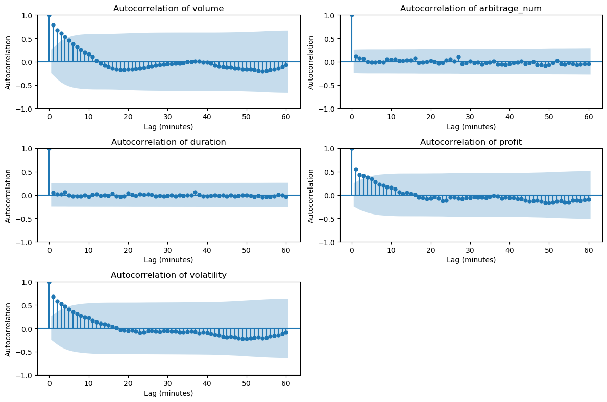

# Exploring Triangular Arbitrage Opportunities on Binance

Triangular arbitrage is a trading strategy that exploits price discrepancies between three different (crypto-) currencies to generate profit. This project focuses on exploring triangular arbitrage opportunities on Binance, one of the largest cryptocurrency exchanges.

**Objective:** \
The goal of this project is to analyze real-time data from the Binance exchange to identify and understand patterns in triangular arbitrage opportunities. This public version of the project has the trade execution logic removed and instead focuses on the collection and analysis of data. It serves as a proof of concept for potential trading strategies.

**Disclaimer:** \
This project is for educational and research purposes only. Any trading decisions should be based on your own analysis and risk tolerance.

## Table of Contents
- [Triangular Arbitrage](#triangular-arbitrage)
- [Definitions](#definitions)
- [Features](#features)
- [Screenshots](#screenshots)
- [Contributing](#contributing)
- [License](#license)

## Triangular Arbitrage

Triangular arbitrage is a trading strategy that exploits price discrepancies between three different assets in the foreign exchange or cryptocurrency markets to generate profit. The basic concept behind triangular arbitrage is the principle of a "no-risk" opportunity due to pricing inefficiencies. Traders monitor exchange rates of three currency pairs that are related, such as USD/EUR, EUR/GBP, and GBP/USD in the forex market, or BTC/ETH, ETH/LTC, and LTC/BTC in the cryptocurrency market. If the exchange rates do not align according to the theoretical exchange rate calculated from the three pairs, an arbitrage opportunity is detected. The trader executes a series of trades to exploit the price discrepancy, starting with one currency, converting it to another, and then back to the original currency, ending up with more of the original currency than they started with. By the end of the series of trades, the trader will have made a profit due to the pricing inefficiency, assuming the trades are executed quickly enough to capitalize on the opportunity before market conditions change.

Triangular arbitrage helps to maintain efficient pricing in the market by quickly correcting pricing discrepancies.

## Definitions

This section provides important definitions and assumptions made in this project.

**Symbol:** \
In the context of this project, a symbol refers to a trading pair on the Binance exchange, consisting of two (crypto-) currencies (e.g., BTC/ETH, LTC/BTC). Each symbol represents the exchange rate between the two (crypto-) currencies in the pair.

**Triangular arbitrage chain or chain:** \
A triangular arbitrage chain, or simply a "chain," refers to a sequence of three symbols that can form a triangular arbitrage opportunity. For example, if we have symbols A/B, B/C, and C/A, this forms a triangular arbitrage chain. Executing a triangular arbitrage chain, starting with a base asset (e.g., currency A), involves the following steps:
1. Buy currency B using the A/B symbol.
2. Buy currency C using the B/C symbol.
3. Sell currency C for currency A using the C/A symbol.

**Triangular arbitrage opportunity or opportunity:** \
A triangular arbitrage opportunity, or simply an "opportunity," is defined as a chain and a set of limit prices that allow the execution of the chain to yield a return greater than zero. The duration of an opportunity is the time between when the limit prices become immediately executable, given the best bid/ask prices in the limit order book and their quantities, and when the best prices in the limit order book have crossed the limit prices of the opportunity.

**Base asset:**
The base asset is the starting and ending currency in a triangular arbitrage chain. It is the currency that is initially held, exchanged for other currencies in the chain, and then ultimately exchanged back to at the end of the chain. The base asset determines the direction of the triangular arbitrage trades and is used to calculate the profit of an arbitrage opportunity.

**Base asset quantity:**
The base asset quantity is the amount of the base asset that is used for the execution of a triangular arbitrage chain. It plays an important role in determining the duration of an opportunity. When an opportunity begins, it is the moment when the limit prices become immediately executable, based on the best bid/ask prices in the limit order book and their quantities. The base asset quantity defines the minimum quantity of the base asset required for the opportunity to be executable.

## Features

List the features of your project.

## Screenshots

Include screenshots or images of your project in action. You can add them like this:

## Contributing

If you're open to contributions, provide guidelines for how others can contribute to your project.

## License

Specify the license for your project, if applicable.
