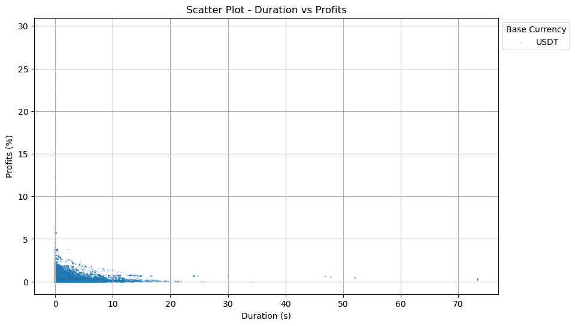
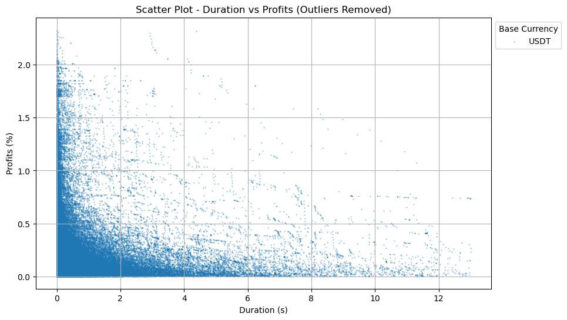
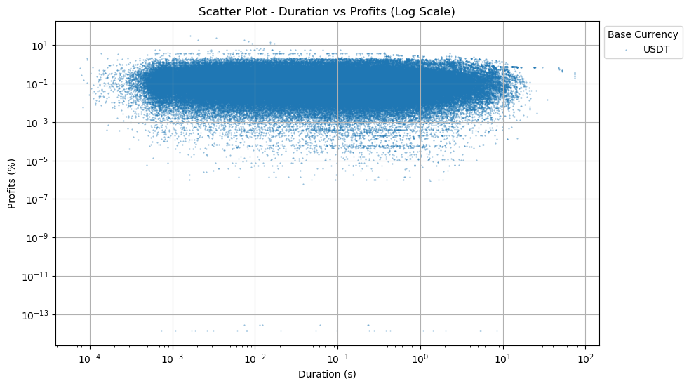
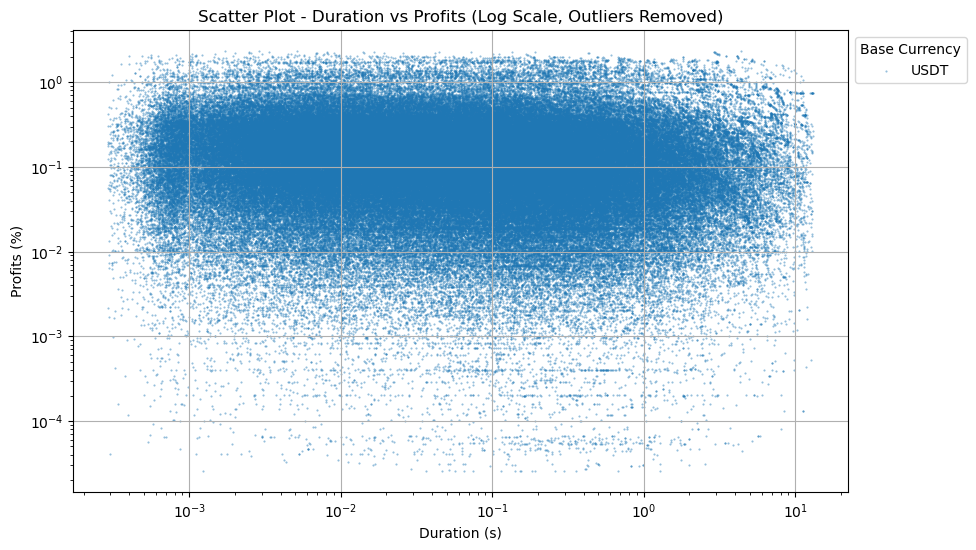
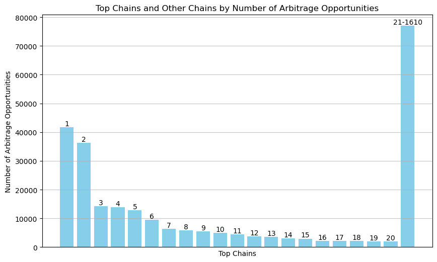
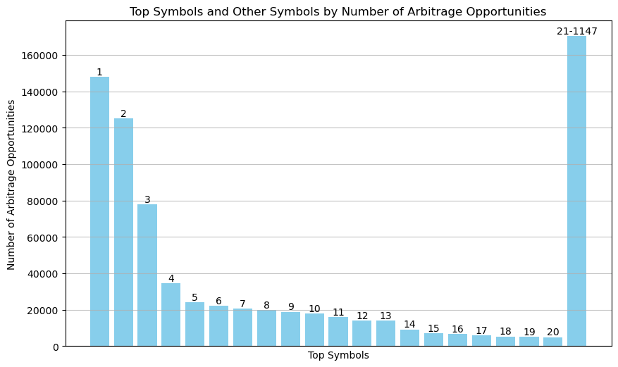
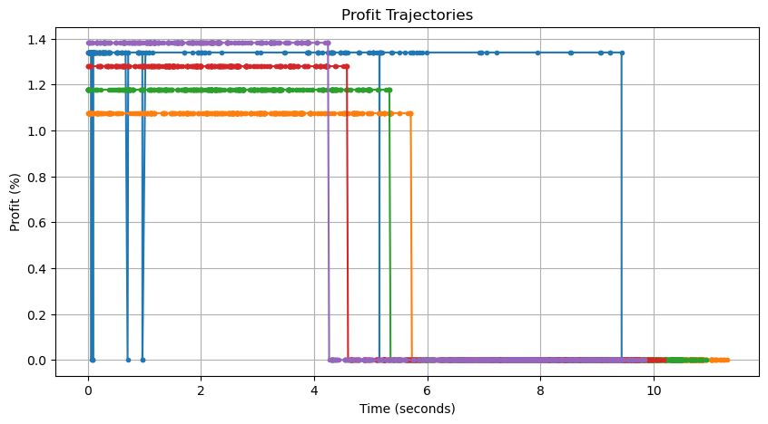
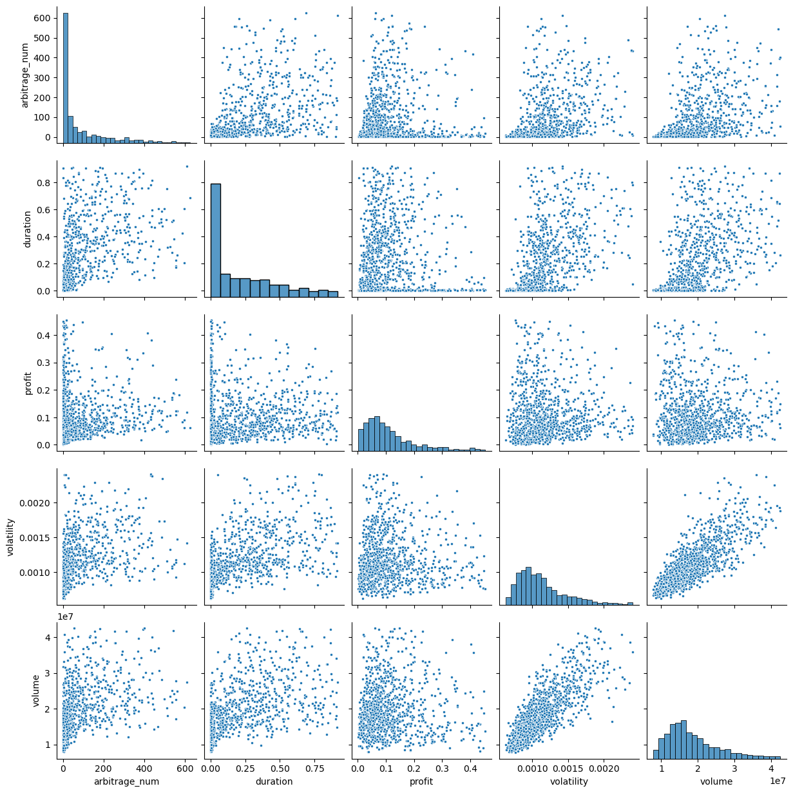
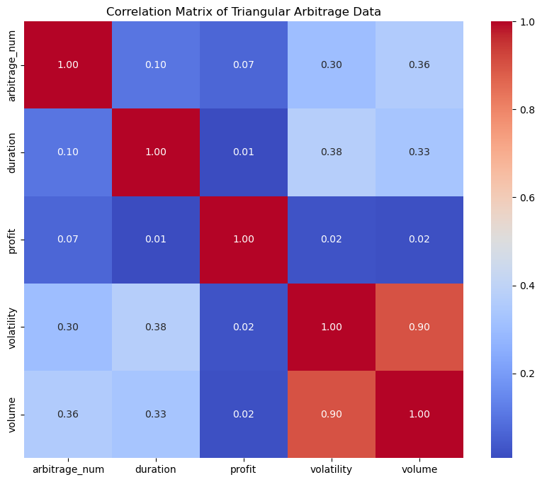
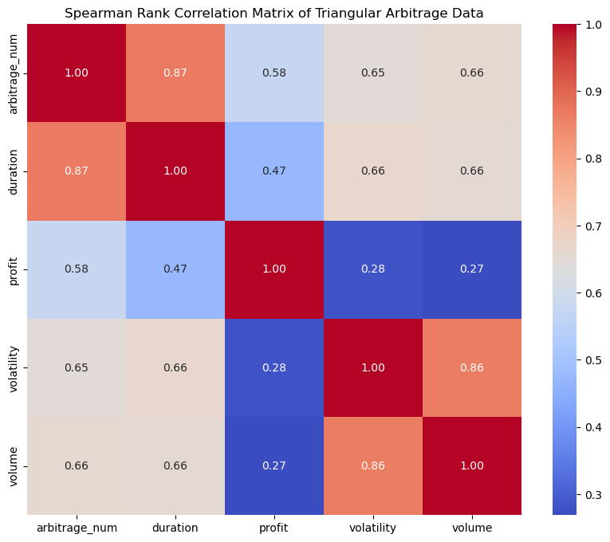

# Exploring Triangular Arbitrage Opportunities on Binance

Triangular arbitrage is a trading strategy that exploits price discrepancies between three different (crypto-) currencies to generate profit. This project focuses on exploring triangular arbitrage opportunities on Binance, one of the largest cryptocurrency exchanges.

**Objective:** \
The goal of this project is to analyze real-time data from the Binance exchange to identify and understand patterns in triangular arbitrage opportunities. This public version of the project has the trade execution logic removed and instead focuses on the collection and analysis of data. It serves as a proof of concept for potential trading strategies.

**Disclaimer:** \
This project is for educational and research purposes only. Any trading decisions should be based on your own analysis and risk tolerance.

## Table of Contents
- [Triangular Arbitrage](#triangular-arbitrage)
- [Definitions](#definitions)
- [Features](#features)
- [Data Analysis](#data-analysis)

## Triangular Arbitrage

Triangular arbitrage is a trading strategy that exploits price discrepancies between three different assets in the foreign exchange or cryptocurrency markets to generate profit. The basic concept behind triangular arbitrage is the principle of a "risk-free" opportunity due to pricing inefficiencies. Traders monitor exchange rates of three currency pairs that are related, such as USD/EUR, EUR/GBP, and GBP/USD in the forex market, or BTC/ETH, ETH/LTC, and LTC/BTC in the cryptocurrency market. If the exchange rates do not align with the theoretical exchange rate calculated from the three pairs, an arbitrage opportunity is detected. The trader executes a series of trades to exploit the price discrepancy, starting with one currency, converting it to another, and then back to the original currency, ending up with more of the original currency than they started with. By the end of the series of trades, the trader will have made a profit due to the pricing inefficiency, assuming the trades are executed quickly enough to capitalize on the opportunity before market conditions change.

Triangular arbitrage helps to maintain efficient pricing in the market by quickly correcting pricing discrepancies.

## Definitions

This section provides important definitions and assumptions used in this project.

**Symbol:** \
In the context of this project, a symbol refers to a trading pair on the Binance exchange, consisting of two (crypto-) currencies (e.g., BTC/ETH, LTC/BTC). Each symbol represents the exchange rate between the two (crypto-) currencies in the pair.

**Triangular arbitrage chain or chain:** \
A triangular arbitrage chain, or 'chain' for short, refers to a sequence of three symbols that can form a triangular arbitrage opportunity. For example, if we have symbols A/B, B/C, and C/A, this forms a triangular arbitrage chain. Executing a triangular arbitrage chain, starting with a base asset (e.g., currency A), involves the following steps:
1. Buy currency B using the A/B symbol.
2. Buy currency C using the B/C symbol.
3. Sell currency C for currency A using the C/A symbol.

**Triangular arbitrage opportunity or opportunity:** \
A triangular arbitrage opportunity, or simply an "opportunity," is defined as a chain and a set of limit prices that allow the execution of the chain to yield a return greater than zero. The duration of an opportunity is the time between when the limit prices become immediately executable, given the best bid/ask prices in the limit order book and their quantities, and when the best prices in the limit order book have crossed the limit prices of the opportunity.

**Base asset:** \
The base asset is the starting and ending currency in a triangular arbitrage chain. It is the currency that is initially held, exchanged for other currencies in the chain, and then ultimately exchanged back to at the end of the chain. The base asset determines the direction of the triangular arbitrage trades and is used to calculate the profit of an arbitrage opportunity.

**Base asset quantity:** \
The base asset quantity is the amount of the base asset that is used for the execution of a triangular arbitrage chain. It plays an important role in determining the duration of an opportunity. When an opportunity begins, it is the moment when the limit prices become immediately executable, based on the best bid/ask prices in the limit order book and their quantities. The base asset quantity defines the minimum quantity of the base asset required for the opportunity to be executable.

**Profit:** \
The profit of a chain is the percentage difference between the base asset quantity before and after the chain's execution. 
The formula for calculating profit is: 
$$\text{Profit} ( \\% ) = \left( \frac{B_{\text{after}} - B_{\text{before}} - \text{Fees}}{B_{\text{before}}} \right) \times 100$$

Where:
- $B_{\text{before}}$ is the base asset amount before the execution of the chain.
- $B_{\text{after}}$ is the base asset amount after the execution of the chain.
- $\text{Fees}$ is the accumulated fees.
The profit calculation takes into account any fees incurred during the execution of the chain. It's important to note that the profit is dependent on the base asset quantity, as the execution of a chain is not a linear operation. This is mainly due to the finite precision and resulting rounding of order quantities.

**Trajectory:** \
In the context of this project, a trajectory refers to a series of data points that represent the profit over time for a specific triangular arbitrage opportunity. Each point in the trajectory consists of a timestamp (relative to the start time of the opportunity) and the corresponding profit at that moment. The profit of an active opportunity is either its starting profit or zero if the quantity in the order book for the best bid/ask prices is not sufficient, but the best prices in the limit order book have not yet crossed the limit prices of the opportunity. The trajectory is updated whenever there is an update to an order book of one of the three symbols involved in the opportunity. Trajectories are used to track the evolution of an opportunity's ability to be immediately executed at or above its starting profitability and to analyze the duration and fluctuations of arbitrage opportunities in the market.

## Features

- **Real-Time Data Analysis:** Utilizing Websockets to listen to real-time order book data for various symbols trading on Binance to identify potential triangular arbitrage opportunities.
- **Dynamic Chain Generation:** Automatically generating triangular arbitrage chains based on the provided base currencies and the currently trading symbols.
- **Opportunity Detection:** Identifying profitable triangular arbitrage opportunities by analyzing price discrepancies across different trading pairs and calculating potential profits.
- **Limit Price Tracking:** Keeping track of limit prices for executing trades and updating profit calculations based on real-time market data.
- **Collecting Minute Market Data:** Calculating the market volume, market volatility, and arbitrage data every minute
- **Database Integration:** Storing data related to arbitrage opportunities, including duration, profit, and trajectories, in a SQLite database for further analysis.
- **Data Visualization:** Providing visualization tools to analyze the collected data and identifying patterns or trends in triangular arbitrage opportunities.
- **Configurable Settings:** Allowing users to configure trading parameters, such as base currencies, quantities, and testnet mode, to tailor the data collection to their specific needs.
- **Logging and Monitoring:** Providing logging and monitoring capabilities to track the performance and detect any potential issues.

## Data Analysis

The data discussed in this sections was collected using a server that was strategically located to minimize latency and ensure close proximity to the servers used by Binance. Doing so, the time required to execute a full triangular arbitrage chain (comprising sending the order to Binance, waiting for Binance to match the order, and receiving confirmation of a filled order) three times was significantly reduced. The optimized setup reduced the total execution time to approximately 0.03 seconds, ensuring timely and efficient execution of arbitrage opportunities.

The data was collected during a roughly 24 hour period between March 13th, 2024 and March 14th, 2024. As a single base asset Tether (USDT) was used. The chosen quantity was 50 USDT.

During this period more than 250 Thousand arbitrage opportunities were recorded. The mean duration of these opportunities was approximately 0.44 seconds, with a median duration of about 0.057 seconds. The longest recorded opportunity lasted about 73 seconds while the shortest lasted just about 76 microseconds. The mean profit of the recorded opportunities was about 0.19% and the median profit was about 0.11%. The highest recorded profit was approximately 29%, while the smallest was about 14 × 10⁻¹⁵%.

Figures 1 - 4 visualize the relationship between the duration of triangular arbitrage opportunities and the profits they yield, measured as a percentage. Each dot represents an arbitrage opportunity, plotted with the duration on the x-axis (in seconds) and the profit on the y-axis.

| Raw | Outliers removed |
| :---: | :---: |
| **Figure 1** | **Figure 2** |
|  |  |
| **Figure 3** | **Figure 4** |
|  |  |

Figure 5 presents a histogram that illustrates the distribution of triangular arbitrage opportunities across the top 20 chains out of all possible chains explored during the data collection period. The x-axis labels each of the top 20 chains by their rank, and the remaining chains are grouped under the label "21-1610," indicating that the remaining chains are included in this group. The y-axis represents the number of arbitrage opportunities detected for each chain. This visualization serves to highlight that specific chains yielded far more frequent opportunities for triangular arbitrage within the observed time frame than other chains.

Figure 6, similarly, displays a histogram categorizing the number of triangular arbitrage opportunities among the top 20 symbols and aggregates the rest under the label "21-1147," representing the remaining symbols. The histogram ranks these symbols based on the frequency of arbitrage opportunities identified, offering insight into which currency pairs presented the most potential for profitable triangular arbitrage transactions. Given the distribution of opportunities across the chains it is no surprise that specific symbols yielded far more freqent opportunities for triangular arbitrage than other symbols.

| Figure 5 | Figure 6 |
| :---: | :---: |
|  |  |

Figures 5 and 6 serve to validate the collected data. If there were a systematic error in the way the triangular arbitrage opportunities are measured, one would expect the distribution of chains and symbols among the opportunities to be more or less random or mainly influenced by volume. However, the histograms show clear patterns. The table listing the chains and symbols with the most opportunities demonstrates that the top symbols do not align with the list of symbols with the highest volume on the Binance exchange. In fact, several symbols included in the list of symbols with the most opportunities rank very low in the list of symbols ranked by volume.

| | Chains with Most Opportunities | Symbols with Most Opportunities (Rank Compared to Volume) | Symbols with Highest Volume |
| :---: | :---: | :---: | :---: |
| 1 | FDUSD/USDT DOGE/FDUSD DOGE/USDT | DOGE/USDT (+7)| BTC/FDUSD |
| 2 | DOGE/USDT DOGE/FDUSD FDUSD/USDT | FDUSD/USDT (+5)| BTC/USDT |
| 3 | DOGE/USDT DOGE/EUR EUR/USDT | DOGE/FDUSD (+8)| ETH/USDT |
| 4 | DOGE/USDT SHIB/DOGE SHIB/USDT | USDT/TRY (+30)| ETH/FDUSD |
| 5 | FDUSD/USDT FLOKI/FDUSD FLOKI/USDT | EUR/USDT | USDC/USDT |
| 6 | DOGE/USDT DOGE/TUSD TUSD/USDT | SHIB/USDT (+3)| SOL/USDT |
| 7 | TUSD/USDT DOGE/TUSD DOGE/USDT | TUSD/USDT (+300)| FDUSD/USDT |
| 8 | EURU/SDT DOGE/EUR DOGE/USDT | DOGE/EUR (+417)| DOGE/USDT |
| 9 | USDT/TRY DOGE/TRY DOGE/USDT | SHIB/DOGE (+475)| SHIB/USDT |
| 10 | SHIB/USDT SHIB/DOGE DOGE/USDT | BTC/USDT (-8)| PEPE/USDT |
| 11 | DOGE/USDT DOGE/BRL USDT/BRL | DOGE/TUSD (+589)| DOGE/FDUSD |
| 12 | DOGE/USDT DOGE/TRY USDT/TRY | FLOKI/USDT (+12)| BNB/FDUSD |
| 13 | USDT/TRY LPT/TRY LPT/USDT | FLOKI/FDUSD (+555)| SOL/FDUSD |
| 14 | FDUSD/USDT PEPE/FDUSD PEPE/USDT | DOGE/TRY (+266)| BNB/USDT |
| 15 | USDT/TRY AMP/TRY AMP/USDT | USDC/USDT (-10)| XRP/USDT |
| 16 | SOL/USDT SOL/FDUSD FDUSD/USDT | USDT/BRL (+145)| WIF/USDT |
| 17 | BTC/USDT BTC/FDUSD FDUSD/USDT | DOGE/BRL (+593)| BOME/USDT| 
| 18 | APT/USDT APT/FDUSD FDUSD/USDT | ETH/USDT (-15)| NEAR/USDT |
| 19 | FDUSD/USDT BTC/FDUSD BTC/USDT | LPT/USDT (+154)| ICP/USDT |
| 20 | USDT/TRY WAVES/TRY WAVES/USDT | LPT/TRY (+690)| FET/USDT |

Figure 7 shows the five longest trajectories with an initial profit of over 1%. Each point on a trajectory represents the recalculation of the profitability of the chain. This calculation is triggered by a change in one of the order books of the three symbols involved in a chain. A change can be either a shift in the best prices or a variation in the quantity at the best prices.

Using this type of visualization, several insights can be gained. Firstly, the points along the trajectories confirm that the program had access to the latest order book data. If the detected arbitrage opportunities were due to networking issues or delays in the execution of the program, there would be significant gaps between two consecutive points. However, the trajectories generally do not exhibit such gaps, indicating that the detected arbitrage opportunities are not due to networking issues or delays in the execution of the program.

Another interesting insight is that before profitable opportunities cease to exist, there can be a period where the required prices can still be achieved, but there is not enough quantity available at the best price. In the plot, this is evident when the trajectory drops to zero. Using limit orders, placed orders to execute a chain might not completely fill, and market orders might experience slippage. For example, the purple trajectory can only be immediately executed at the desired prices for its first four seconds, even though that particular opportunity lasts close to 10 seconds.

Something interesting happens with the blue trajectory: several times, its profit drops to zero before returning to its starting profit. This indicates that during those times, the quantity at the best prices is not sufficient. This can occur when the liquidity at a certain price level in an order book drops below the required amount and then gets refilled.

| Figure 7 |
| :---: |
||

| Figure 8 |
| :---: |
||

| Figure 9 | Figure 10|
| :---: | :---: |
||  |
